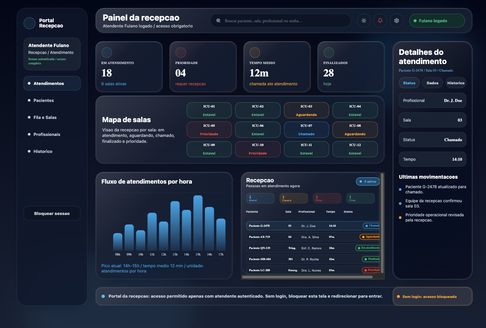
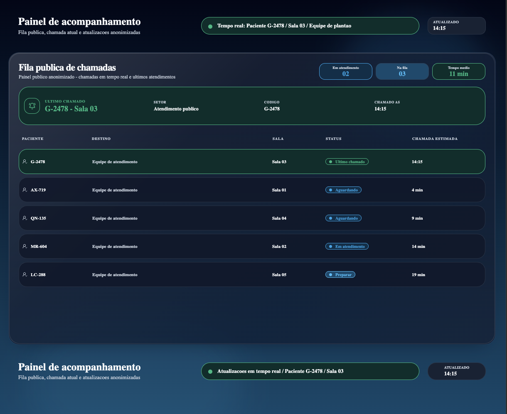
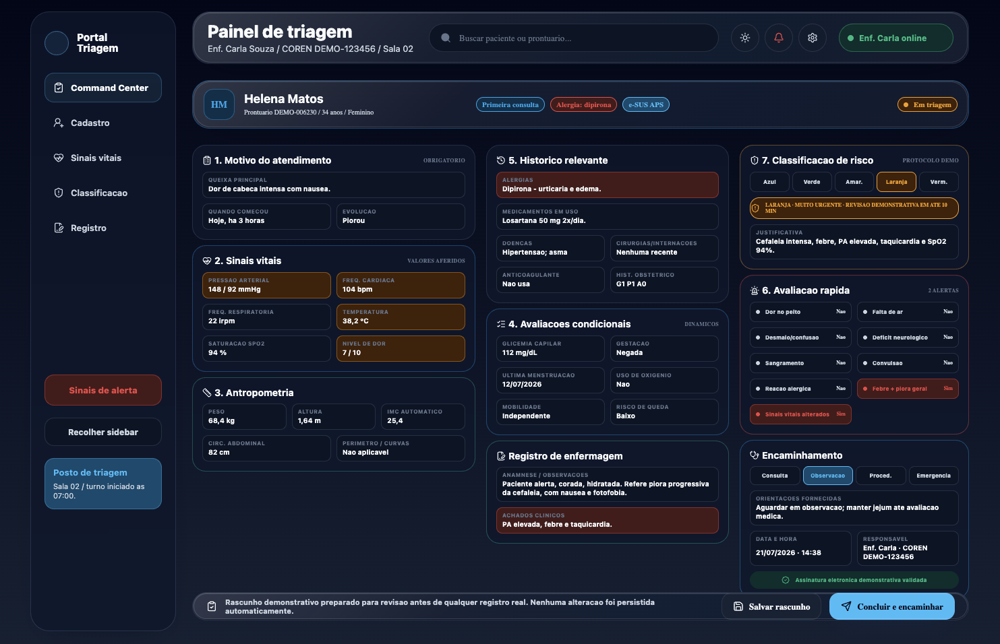
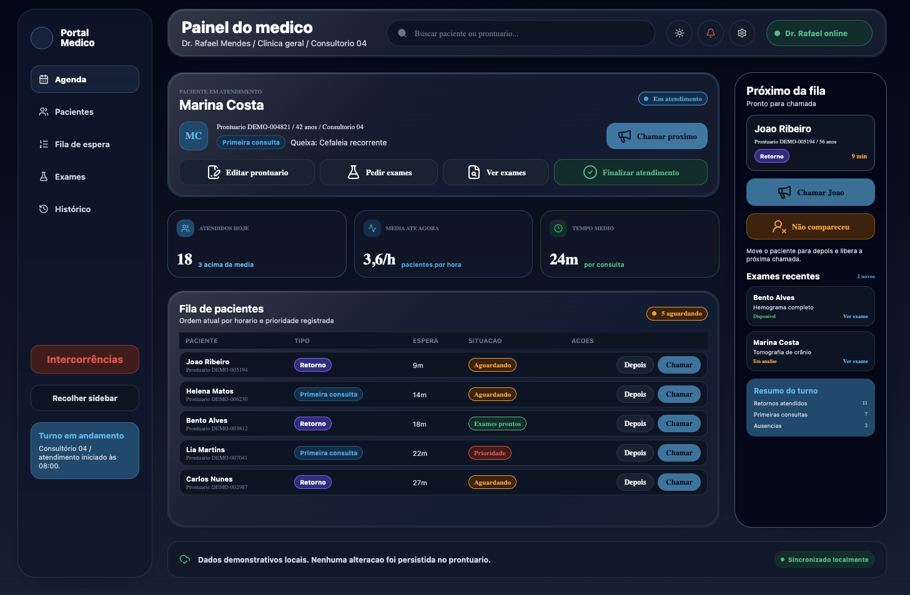

# Clinical Command Center

> High-fidelity front-end prototype exploring digital experiences for healthcare operations.

[Versão em português](README.md)

> [!IMPORTANT]
> This demonstration project is built exclusively with fictional data. It is not intended for clinical or operational use.

**Deployment**

## Overview

The **Clinical Command Center** explores how dense, context-sensitive interfaces can support different journeys within one cohesive digital experience. It combines an operational overview, anonymized public tracking, and specialized workspaces under a consistent visual language.

Rather than reproducing a conventional dashboard, the project focuses on challenges commonly found in complex products:

- turning large amounts of information into a clear visual hierarchy;
- balancing density, legibility, and scanning speed;
- adapting the experience to different usage contexts;
- communicating loading, connectivity, errors, and stale data honestly;
- preserving privacy between public and internal experiences;
- maintaining consistency across light and dark themes and different screen sizes.

## Technical highlights

- five operational experiences sharing the same design system;
- domain-oriented organization and page composition;
- remote data management with TanStack React Query;
- simulated APIs and real-time synchronization with Mock Service Worker;
- public contracts anonymized at the data boundary;
- lazy loading for the main application areas;
- explicit error, reconnection, and stale-data states;
- behavioral testing and semantic accessibility practices.

## Demonstrated experiences

| Experience | Approach |
| --- | --- |
| **Public access** | An anonymized status experience with synchronization, connection, and last-update feedback. |
| **Reception** | An operational overview combining indicators, occupancy, activity, and visit context. |
| **Patients** | A demonstration registry with search, filters, selection, and organized fictional information. |
| **Nursing** | An informational workspace prioritizing context, explicit input, and visual continuity. |
| **Doctor** | A queue-oriented workspace centered on the current visit, local actions, and immediate feedback. |

These experiences use local data and simulated services. No interaction represents actual clinical persistence.

## Gallery

### Public access

An independent public interface designed to communicate progress and availability without exposing identifiable information.

### Reception

A broad operational view designed for quick scanning, with details available without disrupting the main context.

### Nursing

A continuity-oriented composition with independent sections and a visual hierarchy that reduces competition between information.

### Doctor

An experience focused on the current visit and next step while preserving queue visibility and access to primary actions.

> The current screenshots show the dark theme. The gallery will be expanded with light-theme comparisons and additional screen sizes.

## UX and UI approach

### Operational cockpit

The interface follows a cockpit language: essential information remains visible, secondary areas provide context, and actions receive emphasis according to their importance. The goal is to offer density without turning every element into a competing surface.

### Hierarchy before decoration

Color, typography, spacing, icons, and surfaces work together to communicate priority. States never rely on color alone, and visual effects structure the workspace rather than merely decorate it.

### Light and dark as one system

Both themes share the same components and semantics. Appearance is driven by tokens, allowing contrast, surfaces, text, and status colors to change without duplicating screen structures.

### Content-driven responsiveness

The workspaces reorganize navigation, grids, tables, and side panels according to available space. On smaller screens, the priority shifts toward sequential reading, accessible controls, and preserved context.

## Conceptual architecture

The project separates visual experience, behavior, and data boundaries through clear responsibility layers:

**Routes → composition pages → domains → shared components → UI primitives → theme and infrastructure**

The main principles are:

- domain-oriented organization that keeps each journey independent and understandable;
- small pages responsible only for composing an experience;
- components with a focused visual or operational responsibility;
- state kept close to its actual consumers;
- data access kept outside presentation components;
- reusable primitives with no clinical context;
- a single token source for themes, spacing, typography, and statuses.

## Simulated synchronization

The public experience demonstrates a boundary similar to a connected application:

- an initial snapshot is loaded over HTTP;
- real-time events signal new updates;
- versioning prevents older information from replacing newer data;
- reconnecting, unavailable, and potentially stale states are visible;
- requests and connections are cleaned up when no longer needed.

This entire layer is simulated with **Mock Service Worker (MSW)**. It demonstrates interface states and contracts rather than representing real hospital infrastructure.

## Quality and accessibility

- behavioral tests for components, journeys, and simulated services;
- queries and interactions based on accessible names and roles;
- visible focus and keyboard-compatible primary controls;
- announcements for loading, synchronization, and action feedback;
- textual alternatives for data visualizations;
- reduced-motion preference support;
- experience-specific loading structures;
- on-demand loading of the main areas;
- a dedicated test for anonymization of the public response.

These practices demonstrate an accessibility-minded approach but do not represent a formal compliance certification.

## Privacy by design

The public experience does not receive the same information set used by the internal demonstration areas. Anonymization happens at the data boundary rather than through visual hiding alone.

Internal areas use fictional data only and explicitly indicate when an action changes local demonstration state. The prototype does not include authentication, authorization, auditing, or production security guarantees.

## Technologies

| Area | Technologies |
| --- | --- |
| Interface | React, TypeScript, and React Router |
| Build | Vite |
| Styling and themes | styled-components |
| Data and cache | TanStack React Query |
| Visualization | Recharts |
| Icons and primitives | Lucide React and Base UI |
| API simulation | Mock Service Worker |
| Testing | Vitest and Testing Library |
| Quality | Biome and TypeScript |

## Current status

**Available in the demonstration**

- five visual experiences connected by the same design system;
- light and dark themes;
- search, filtering, selection, and local demonstration actions;
- progressive loading and explicit states;
- simulated public synchronization;
- behavioral coverage of the main journeys.

**Outside the current scope**

- a real backend and database;
- authentication, authorization, and access control;
- clinical information persistence;
- a complete electronic medical record;
- audit trails;
- hospital system integrations;
- validation for clinical or production use.

## About this repository

This repository showcases the project's architecture, user experience, and interface design.

The source code is intentionally kept private and is not publicly available at this time.

## Demonstration

The published application link will be added soon.
